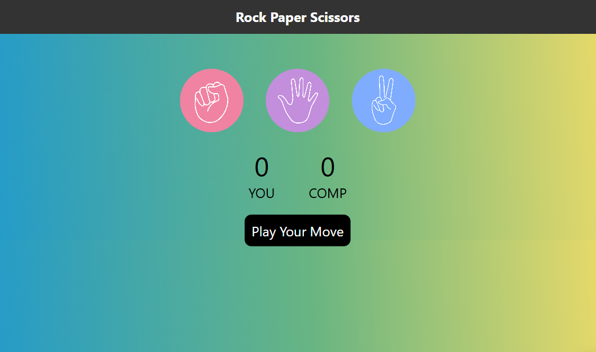

# Rock Paper Scissors Game

A simple browser-based Rock Paper Scissors game built with HTML, CSS, and JavaScript.

## Project Structure

- `index.html` - main page markup
- `style.css` - styling for the game UI
- `game.js` - game logic and user interaction
- `rock.png` - rock choice image
- `paper.png` - paper choice image
- `scissors.png` - scissors choice image

## Preview

## How to Run

1. Open `index.html` in your browser.
2. Choose Rock, Paper, or Scissors.
3. See the result and play again.

## Notes

- This project is a static frontend game.
- Images are included in the project folder and used in the game UI.
